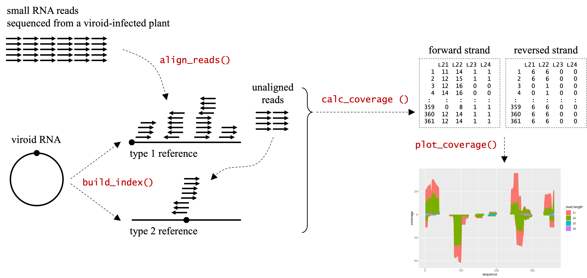

```{r style, echo=FALSE, results='hide', message=FALSE}
knitr::opts_chunk$set(tidy = FALSE,
                      cache = FALSE,
                      error = TRUE,
                      warning = FALSE,
                      message = FALSE,
                      dev = 'png')
library(CircSeqAlignTk)
set.seed(1)
```


# Installation

To install the `r Biocpkg('CircSeqAlignTk')` package,
start R (≥ 4.2) and run the following steps:

```{r install_package, eval=FALSE}
if (!requireNamespace('BiocManager', quietly = TRUE))
    install.packages('BiocManager')
BiocManager::install('CircSeqAlignTk')
```

Note that to install the latest version of the `r Biocpkg('CircSeqAlignTk')`
package, the latest version of R is required.


# Preparation of working directory

CircSeqAlignTk is designed for end-to-end RNA-Seq data analysis
of circular genome sequences, from alignment to visualization.
The whole processes will generate many files
including genome sequence indexes, and intermediate and final alignment results.
Thus, it is recommended to specify a working directory to save these files.
Here, for convenience in package development and validation,
we use a temporary folder
which is automatically arranged by the `tempdir` function
as the working directory.

```{r quick_start__tempws}
ws <- tempdir()
```

However, instead of using a temporary folder,
users can specify a folder on the desktop or elsewhere,
depending on the analysis project.
For example:


```{r quick_start__ws, eval=FALSE}
ws <- '~/desktop/viroid_project'
```


# Quick start


Viroids are composed of 246–401 nt, single-stranded circular non-coding RNAs
[@Hull_2014; @Flores_2015; @Gago_2016].
Sequencing small RNAs from viroid-infected plants
could offer insights regarding the mechanisms of infection
and eventually help prevent these infections in plants.
The common workflow for analyzing such data involves the following steps:
(i) limit read-length between 21 and 24 nt,
as small RNAs derived from viroids are known to be in this range,
(ii) align these reads to viroid genome sequences,
and (iii) visualize the coverage of alignment
to identify the pathogenic region of the viroid.
This section demonstrates the workflow using a sample RNA-Seq dataset.
It includes workflow from the FASTQ format file
to the visualization of the analyzed results,
for analyzing small RNA-seq data sequenced from viroid-infected plants.  


The FASTQ format file used in this section
is attached in the `r Biocpkg('CircSeqAlignTk')` package
and can be obtained using the `system.file` function.
This FASTQ format file contains 29,178 sequence reads of small RNAs
that were sequenced from a tomato plant
infected with the potato spindle tuber viroid (PSTVd) isolate Cen-1 (FR851463).


```{r quick_start__preparation_fastq}
fq <- system.file(package = 'CircSeqAlignTk', 'extdata', 'srna.fq.gz')
```


The genome sequence of PSTVd isolate Cen-1 in FASTA format can be downloaded
from [GenBank](https://www.ncbi.nlm.nih.gov/nuccore/FR851463)
or [ENA](https://www.ebi.ac.uk/ena/browser/view/FR851463) 
using the accession number FR851463.
It is also attached in the `r Biocpkg('CircSeqAlignTk')` package,
and can be obtained using the `system.file` function.


```{r quick_start__preparation_reference}
genome_seq <- system.file(package = 'CircSeqAlignTk', 'extdata', 'FR851463.fa')
```


To ensure alignment quality,
trimming adapter sequences from the sequence reads is required,
because most sequence reads in this FASTQ format file contain adapters
with sequence "AGATCGGAAGAGCACACGTCTGAACTCCAGTCAC".
Here, we use [AdapterRemoval](https://adapterremoval.readthedocs.io/en/stable/)
(@adapterremoval) implemented in the `r Biocpkg('Rbowtie2')` [@rbowtie2] package
to trim the adapters before aligning the sequence reads.
Note that the length of small RNAs derived from viroids
is known to be in the range of 21–24 nt.
Therefore, we set an argument to remove sequence reads with lengths
outside this range after adapter removal.


```{r quick_start__triming}
library(R.utils)
library(Rbowtie2)
adapter <- 'AGATCGGAAGAGCACACGTCTGAACTCCAGTCAC'

# decompressed the gzip file for trimming to avoid errors from `remove_adapters`
gunzip(fq, destname=file.path(ws, 'srna.fq'), overwrite = TRUE, remove = FALSE)

trimmed_fq <- file.path(ws, 'srna_trimmed.fq')
params <- '--maxns 1 --trimqualities --minquality 30 --minlength 21 --maxlength 24'
remove_adapters(file1 = file.path(ws, 'srna.fq'),
                adapter1 = adapter,
                adapter2 = NULL,
                output1 = trimmed_fq,
                params,
                basename = file.path(ws, 'AdapterRemoval.log'),
                overwrite = TRUE)
```


After obtaining the cleaned FASTQ format file (i.e., `srna_trimmed.fq.gz`),
we build index files and perform alignment
using the `build_index` and `align_reads` functions
implemented in the `r Biocpkg('CircSeqAlignTk')` package.
To precisely align the reads to the circular genome sequence of the viroid,
the alignment is performed in
[two stages](#two-stage-alignment-process).


```{r quick_start__alignment}
ref_index <- build_index(input = genome_seq, 
                         output = file.path(ws, 'index'))
aln <- align_reads(input = trimmed_fq, 
                   index = ref_index,
                   output = file.path(ws, 'align_results'))
```


The index files are stored in a directory specified by the `output` argument
of the `build_index` function.
The intermediate files (e.g., FASTQ format files used as inputs)
and alignment results (e.g., BAM format files) are stored in
the directory specified by the `output` argument of the `align_reads` function.
BAM format files with the suffixes of `.clean.t1.bam` and `.clean.t2.bam` are
the final results obtained after alignment.
Refer to the sections
\@ref(generation-of-reference-sequences) and \@ref(alignment)
for a detailed description of each of the files generated by each function.

The alignment coverage can be summarized with the `calc_coverage` function.
This function loads the alignment results
(i.e., `*.clean.t1.bam` and `*.clean.t2.bam`),
calculates alignment coverage from these BAM format files,
and combines them into two data frames according to the aligned strands.


```{r quick_start__summary}
alncov <- calc_coverage(aln)
head(get_slot_contents(alncov, 'forward'))  # alignment coverage in forward strand 
head(get_slot_contents(alncov, 'reversed')) # alignment coverage in reversed strand 
```


The alignment coverage can be then visualized using the `plot` function
(Figure \@ref(fig:quickStartVisualization)).
The scale of the upper and lower directions indicate alignment coverage of
the forward and reversed strands, respectively.


```{r quickStartVisualization, fig.cap='Alignment coverage. The alignment coverage of the case study.'}
plot(alncov)
```


# Implementation 

## Two-stage alignment process

Circular genome sequences are generally represented as linear sequences in the
FASTA format during analysis.
Consequently, sequence reads obtained from organelles or organisms
with circular genome sequences can be aligned anywhere,
including at both ends of the sequence represented in the FASTA format.
Using existing alignment tools such as
[Bowtie2](http://bowtie-bio.sourceforge.net/bowtie2/index.shtml) [@bowtie2] and
[HISAT2](https://daehwankimlab.github.io/hisat2/) [@hisat2] to align such
sequence reads onto circular sequences may fail, because these tools are
designed to align sequence reads to linear genome sequences and their
implementation does not assume that a single read can be aligned to both ends
of a linear sequence.
To solve this problem, that is, allowing reads to be aligned to both ends,
the `r Biocpkg('CircSeqAlignTk')` package implements a two-stage
alignment process (Figure \@ref(fig:packageImplementation)),
using these existing alignment tools
([Bowtie2](http://bowtie-bio.sourceforge.net/bowtie2/index.shtml)
and [HISAT2](https://daehwankimlab.github.io/hisat2/)).

```{r packageImplementation, fig.cap='Two-stage alignment process. Overview of the two-stage alignment process and the related functions in the CircSeqAlignTk package', echo=FALSE, fig.wide=TRUE}

```

To prepare for the two-stage alignment process, two types of reference
sequences are generated from the same circular genome sequence.
The type 1 reference sequence is a linear sequence generated
by cutting a circular sequence at an arbitrary location.
The type 2 reference is generated
by restoring the type 1 reference sequence into a circular sequence and
cutting the circle at the opposite position to type 1 reference sequence.
The type 1 reference sequence is the input genome sequence itself,
while the type 2 reference sequence is newly created
(by the `build_index` function).

Once the two reference sequences are generated,
the sequence reads are aligned to the two types of reference sequences
in two stages:
(i) aligning all sequence reads onto the type 1 reference sequences,
and (ii) collecting the unaligned sequence reads
and aligning them to the type 2 reference.
Alignment can be performed with
[Bowtie2](http://bowtie-bio.sourceforge.net/bowtie2/index.shtml) or
[HISAT2](https://daehwankimlab.github.io/hisat2/) depending on the options
specified by the user.


## Generation of reference sequences

The `build_index` function is designed
to generate type 1 and type 2 reference sequences for alignment.
This function has two required arguments,
`input` and `output` which are used for
specifying a file path to a genome sequence in FASTA format and
a directory path to save the generated type 1 and type 2 reference sequences,
respectively.
The type 1 and type 2 reference sequences are saved in files
`refseq.t1.fa` and `refseq.t2.fa` in FASTA format, respectively.

Following the generation of reference sequences,
The `build_index` function then creates index files
for each reference sequence for alignment.
The index files are saved with the prefix `refseq.t1.*` and `refseq.t2.*`.
They correspond to the type 1 and 2 reference sequences
(i.e., `refseq.t1.fa` and `refseq.t2.fa`), respectively.
The extension of index files depends on the alignment tool.

Two alignment tools 
([Bowtie2](http://bowtie-bio.sourceforge.net/bowtie2/index.shtml) and
[HISAT2](https://daehwankimlab.github.io/hisat2/)) can be specified for
creating index files through the `aligner` argument.
If [Bowtie2](http://bowtie-bio.sourceforge.net/bowtie2/index.shtml)
is specified, then the extension is `.bt2`  or `.bt2l`;
if [HISAT2](https://daehwankimlab.github.io/hisat2/) is specified,
then the extension is `.ht2` or `.ht2l`.
By default, [Bowtie2](http://bowtie-bio.sourceforge.net/bowtie2/index.shtml)
is used.
The `build_index` function first attempts to call the specified alignment tool
directly installed on the operation system; however, if the tool is not
installed, the function will then attempt to call the `bowtie2_build` or
`hisat2_build` functions implemented in `r Biocpkg('Rbowtie2')`
or `r Biocpkg('Rhisat2')` packages for indexing.

For example, to generate reference sequences and index files for alignment
against the viroid PSTVd isolate Cen-1 (FR851463) using
[Bowtie2](http://bowtie-bio.sourceforge.net/bowtie2/index.shtml)/`r Biocpkg('Rbowtie2')`,
we set the argument `input` to the FASTA format file containing the sequence
of FR851463 and execute the `build_index` function.
The generated index files will be saved into the folder
specified by the argument `output`.


```{r implementation__build_index}
genome_seq <- system.file(package='CircSeqAlignTk', 'extdata', 'FR851463.fa')
ref_index <- build_index(input = genome_seq, output = file.path(ws, 'index'))
```


The function returns a `CircSeqAlignTkRefIndex` class object that contains the
file path to type 1 and 2 reference sequences and corresponding index files.
The data structure of `CircSeqAlignTkRefIndex` can be verified using the
`str` function.


```{r implementation__build_index_output}
str(ref_index)
```


The file path to type 1 and type 2 reference sequences, `refseq.type1.fa` and
`refseq.type2.fa`, can be checked through the `@fasta` slot
using the `get_slot_contents` function.


```{r implementation__build_index_output_refseq}
get_slot_contents(ref_index, 'fasta')
```


The file path (prefix) to the index files, `refseq.t1.*.bt2` and
`refseq.t2.*.bt2`, can be checked through `@index` slot.


```{r implementation__build_index_output_index}
get_slot_contents(ref_index, 'index')
```


Note that, users can simply use the `slot` function or `@` operator
to access these slot contents instead of using the `get_slot_contents` function.
For example,


```{r access_slot_content, eval=FALSE}
slot(ref_index, 'fasta')
slot(ref_index, 'index')

ref_index@fasta
ref_index@index
```


As mentioned previously,
the type 2 reference is generated 
by restoring the type 1 reference sequence to a circular sequence
and cutting the circular sequence at the opposite position of type 1.
The cutting position based on the type 1 reference
sequence coordinate can be checked from the `@cut_loc` slot.


```{r implementation__build_index_cutloci}
get_slot_contents(ref_index, 'cut_loc')
```


By default, 
[Bowtie2](http://bowtie-bio.sourceforge.net/bowtie2/index.shtml)/`r Biocpkg('Rbowtie2')`
is used for indexing.
This can be changed to
[HISAT2](https://daehwankimlab.github.io/hisat2/)/`r Biocpkg('Rhisat2')` using
the `aligner` argument.


```{r implementation__build_ht2index, eval=FALSE}
ref_ht2index <- build_index(input = genome_seq,
                            output = file.path(ws, 'ht2index'),
                            aligner = 'hisat2')
```


## Alignment

The `align_reads` function is used to align sequence reads onto a circular
genome sequence.
This function requires three arguments: `input`, `index`, and `output`,
which are used to specify a file path to RNA-seq reads in FASTQ format,
a `CircSeqAlignTkRefIndex` class object generated by the `build_index` function,
and a directory path to save the intermediate and final results, respectively.

This function aligns sequence reads within
the [two-stage alignment process](#two-stage-alignment-process) described above.
Thus,
it (i) aligns reads to the type 1 reference sequence (i.e., `refseq.t1.fa`)
and (ii) collects the unaligned reads and aligns
them with the type 2 reference sequence (i.e., `refseq.t2.fa`).

Two alignment tools
([Bowtie2](http://bowtie-bio.sourceforge.net/bowtie2/index.shtml)
and [HISAT2](https://daehwankimlab.github.io/hisat2/))
can be specified for sequence read alignment.
By default, [Bowtie2](http://bowtie-bio.sourceforge.net/bowtie2/index.shtml) 
is used, and it can be changed with the `alinger` argument.
Similar to the `build_index` function,
the `align_reads` function first attempts to call the specified alignment tool
directly installed on the operation system;
however, if the tool is not installed,
the function then attempts to call
the `bowtie2_build` or `hisat2_build` function implemented in
`r Biocpkg('Rbowtie2')` or `r Biocpkg('Rhisat2')` packages for alignment.

The following example is aligning RNA-Seq reads in FASTQ format (`fq`)
on the reference index (`ref_index`) of PSTVd isolate Cen-1 (FR851463) which was generated
at the section \@ref(generation-of-reference-sequences).
The alignment results will be stored into the folder specified
by the argument `output`.

```{r implementation__align_read}
fq <- system.file(package='CircSeqAlignTk', 'extdata', 'srna.fq.gz')
# trimming the adapter sequences if needed before alignment, omitted here.

aln <- align_reads(input = fq,
                   index = ref_index,
                   output = file.path(ws, 'align_results'))
```


This function returns a `CircSeqAlignTkAlign` class object containing the 
path to the intermediate files and final alignment results.


```{r implementation__align_read_output}
str(aln)
```


The alignment results are saved as BAM format files
in the specified directory with the suffixes of `*.t1.bam` and `*.t2.bam`.
The original alignment results may contain mismatches.
Hence, this function performs filtering
to remove alignment with the mismatches over the specified value
from the BAM format file.
Filtering results for `*.t1.bam` and `*.t2.bam`
are saved as `*.clean.t1.bam` and `*.clean.t2.bam`, respectively.
The path to the original and filtered BAM format files
can be checked using `@bam` and `@clean_bam` slots, respectively.


```{r implementation__align_read_output_bam}
get_slot_contents(aln, 'bam')
get_slot_contents(aln, 'clean_bam')
```


The alignment statistics (for example, number of input sequence reads,
number of aligned reads) can be checked using the `@stats` slot.


```{r implementation__align_read_stats}
get_slot_contents(aln, 'stats')
```


By default, the `align_read` function allows a single mismatch in the alignment
of each read (i.e., `n_mismatch = 1`).
To forbid a mismatch or allow more mismatches,
assign `0` or a large number to the `n_mismatch` argument.


```{r implementation__align_read__mismatch}
aln <- align_reads(input = fq,
                   index = ref_index,
                   output = file.path(ws, 'align_results'),
                   n_mismatch = 0)
```


The number of threads for alignment
can be specified using the `n_threads` argument.
Setting a large number of threads
(but not exceeding the computer limits)
can accelerate the speed of alignment.


```{r implementation__align_read__threads}
aln <- align_reads(input = fq,
                   index = ref_index,
                   output = file.path(ws, 'align_results'),
                   n_threads = 4)
```


Additional arguments to be directly passed on to the alignment tool can be
specified with the `add_args` argument.
For example, to increase the alignment sensitivity,
we set the maximum number of mismatches to 1
and the length of seed substrings for alignment to 20
during the process of the Bowtie2 
[multiseed alignment](http://bowtie-bio.sourceforge.net/bowtie2/manual.shtml#multiseed-heuristic).
See the
[Bowtie2 website](http://bowtie-bio.sourceforge.net/bowtie2/manual.shtml#command-line)
to find additional parameters of Bowtie2.


```{r implementation__align_read__add_params, eval=FALSE}
aln <- align_reads(input = fq,
                   index = ref_index,
                   output = file.path(ws, 'align_results'),
                   add_args = '-L 20 -N 1')
```


To use
[HISAT2](https://daehwankimlab.github.io/hisat2/)/`r Biocpkg('Rhisat2')`,
assign `hisat2` to the `aligner` argument.


```{r implementation__align_read__hisat2, eval=FALSE}
aln <- align_reads(input = fq,
                   index = ref_ht2index ,
                   output = file.path(ws, 'align_results'),
                   aligner = 'hisat2')
```


## Summarization and visualization of alignment results

Summarization and visualization of the alignment results can be performed with
the `calc_coverage` and `plot` functions, respectively.
The `calc_coverage` function calculates alignment coverage
from the two BAM files, `*.clean.t1.bam` and `*.clean.t2.bam`,
generated by the `align_reads` function.


```{r implementation__summary}
alncov <- calc_coverage(aln)
```


This function returns a `CircSeqAlignTkCoverage` class object.
Alignment coverage of the reads aligned in the forward and reversed strands
are stored in the `@forward` and `@reversed` slots, respectively,
as a data frame.


```{r implementation__summary_fwd}
head(get_slot_contents(alncov, 'forward'))
head(get_slot_contents(alncov, 'reversed'))
```


Coverage can be visualized with an area chart  using the `plot` function.
In the chart, the upper and lower directions of the y-axis
represent the alignment coverage of reads with forward and reversed strands,
respectively.


```{r implementationVisualization, fig.cap='Alignment coverage.'}
plot(alncov)
```

To plot alignment coverage of the reads with a specific length,
assign the targeted length to the `read_lengths` argument.

```{r implementationVisualizationReadlen, fig.cap='Alignment coverage of reads with the specific lengths.'}
plot(alncov, read_lengths = c(21, 22))
```

As the `plot` function returns a ggplot2 class object,
we can use additional functions
implemented in the `r CRANpkg('ggplot2')` package [@ggplot2]
to decorate the chart, for example:

```{r implementationVisualizationOption1, fig.cap='Alignment coverage arranged with ggplot2.'}
library(ggplot2)
plot(alncov) + facet_grid(strand ~ read_length, scales = 'free_y')
```

```{r, implementationVisualizationOption2, fig.cap='Alignment coverage represented in polar coordinate system.'}
plot(alncov) + coord_polar()
```


# Synthetic small RNA-Seq data

## Generation of synthetic sequence reads

The `r Biocpkg('CircSeqAlignTk')` package implements the `generate_fastq`
function to generate synthetic sequence reads in FASTQ format to mimic RNA-Seq
data sequenced from organelles or organisms with circular genome sequences.
This function is intended for the use of developers,
to help them evaluate the performance of alignment tools,
new alignment algorithms, and new workflows.

To generate synthetic sequence reads with default parameters 
and save them into a file named `synthetic_reads.fq.gz`
in GZIP-compressed FASTQ format,
run the following command.
By default, it generates 10,000 reads.

```{r sim__default_params}
sim <- generate_reads(output = file.path(ws, 'synthetic_reads.fq.gz'))
```


This function returns a `CircSeqAlignTkSim` class object whose
data structure can be checked with the `str` function, as follows:

```{r sim__default_params_str}
str(sim)
```


The parameters for generating the peaks of alignment coverage
can be checked using `@peak` slot.


```{r sim__default_params_peak}
head(get_slot_contents(sim, 'peak'))
```

The parameters for sequence-read sampling
can be checked using the `@read_info` slot.
The first four columns (i.e., `mean`, `std`, `strand`, and `prob`) 
represent peak information used for sampling sequence reads;
the next two columns (i.e., `start` and `end`) are
the exact start and end position of the sampled sequence reads, respectively;
and the last two columns (i.e., `sRNA` and `length`) are
the nucleotides and length of the sampled sequence reads.


```{r sim__default_params_readinfo}
dim(get_slot_contents(sim, 'read_info'))
head(get_slot_contents(sim, 'read_info'))
```


The alignment coverage of the synthetic sequence reads
are stored in the `@coverage` slot as a `CircSeqAlignTkCoverage` class object.
This can be visualized using the `plot` function.


```{r simDefaultParamsCoverageFig, fig.cap='Alignment coverage of the synthetic data.'}
alncov <- get_slot_contents(sim, 'coverage')
head(get_slot_contents(alncov, 'forward'))
head(get_slot_contents(alncov, 'reversed'))
plot(alncov)
```


## Examples of sequence read generation with additional paramaters

To change the number of sequence reads that need to be generated,
use the `n` argument in the `generate_reads` function.


```{r sim__args_n}
sim <- generate_reads(n = 1e3, output = file.path(ws, 'synthetic_reads.fq.gz'))
```


By default, the `generate_reads` function generates sequence reads from the
genome sequence of the viroid PSTVd isolate Cen-1
([FR851463](https://www.ebi.ac.uk/ena/browser/view/FR851463)).
To change the seed genome sequence for sequence read sampling,
users can specify a sequence as characters or as a file path to the FASTA
format file containing a sequence using the `seq` argument.


```{r sim__args_seq}
genome_seq <- 'CGGAACTAAACTCGTGGTTCCTGTGGTTCACACCTGACCTCCTGACAAGAAAAGAAAAAAGAAGGCGGCTCGGAGGAGCGCTTCAGGGATCCCCGGGGAAACCTGGAGCGAACTGGCAAAAAAGGACGGTGGGGAGTGCCCAGCGGCCGACAGGAGTAATTCCCGCCGAAACAGGGTTTTCACCCTTCCTTTCTTCGGGTGTCCTTCCTCGCGCCCGCAGGACCACCCCTCGCCCCCTTTGCGCTGTCGCTTCGGCTACTACCCGGTGGAAACAACTGAAGCTCCCGAGAACCGCTTTTTCTCTATCTTACTTGCTCCGGGGCGAGGGTGTTTAGCCCTTGGAACCGCAGTTGGTTCCT'

sim <- generate_reads(seq = genome_seq,
                      output = file.path(ws, 'synthetic_reads.fq.gz'))
```


By default, `generate_reads` function generates sequence reads
with the adapter sequence "AGATCGGAAGAGCACACGTCTGAACTCCAGTCAC".
To change the adapter sequence, specify a sequence as characters
or as a file path to a FASTA format file containing a adapter sequence
using the `adapter` argument.
For example, the following scripts generate reads with 150 nt,
containing the adapter sequence "AAAAAAAAAAAAAAAAAAAAAAAAAAAAAA".


```{r sim__args_adapter}
adapter <- 'AAAAAAAAAAAAAAAAAAAAAAAAAAAAAA'
sim <- generate_reads(adapter = adapter, 
                      output = file.path(ws, 'synthetic_reads.fq.gz'),
                      read_length = 150)
```


In contrast, to generate sequence reads without adapter sequences,
run the `generate_reads` function with `adapter = NA`.


```{r sim__args_adapter_NA}
sim <- generate_reads(adapter = NA, 
                      output = file.path(ws, 'synthetic_reads.fq.gz'),
                      read_length = 150)
```


The `generate_reads` function also implements a process that introduces several
mismatches into the reads after sequence-read sampling.
To introduce a single mismatch for each sequence read
with a probability of 0.05,
set the `mismatch_prob` argument to `0.05`.


```{r sim__args_mismatch_1}
sim <- generate_reads(output = file.path(ws, 'synthetic_reads.fq.gz'),
                      mismatch_prob = 0.05)
```


To allow a single sequence read to have multiple mismatches,
assign multiple values to the `mismatch_prob` argument.
For example, using the following scripts,
the function first generates 10,000 reads.
Then, introduce the first mismatches against all sequence reads
with the probability of 0.05.
This will generate approximately 500 (i.e., 10,000 x 0.05) sequence reads 
containing a mismatch.
Next, the function introduces a second mismatch  against the sequence reads
with a single mismatch with the probability of 0.1.
Thus, this will generate approximately 50 (i.e., 500 x 0.1) sequence reads
containing two mismatches.


```{r sim__args_mismatch_2}
sim <- generate_reads(output = file.path(ws, 'synthetic_reads.fq.gz'),
                      mismatch_prob = c(0.05, 0.1))
```


In addition, the `generate_reads` provide some groundbreaking arguments,
`srna_length` and `peaks`,
to specify the length and strand of sequence reads
and the positions of peaks of the alignment coverage, respectively.
Using these arguments allows users to generate synthetic sequence reads
that are very close to the real small RNA-Seq data
sequenced from viroid-infected plants.
The following is an example of how to use these arguments:


```{r simSetLengthAndPeaksScripts}
peaks <- data.frame(
    mean   = c(   0,   25,   70,   90,  150,  240,  260,  270,  330,  350),
    std    = c(   5,    5,    5,    5,   10,    5,    5,    1,    2,    1),
    strand = c( '+',  '+',  '-',  '-',  '+',  '+',  '-',  '+',  '+',  '-'),
    prob   = c(0.10, 0.10, 0.18, 0.05, 0.03, 0.18, 0.15, 0.10, 0.06, 0.05)
)
srna_length <- data.frame(
    length = c(  21,   22,   23,   24),
    prob   = c(0.45, 0.40, 0.10, 0.05)
)

sim <- generate_reads(n = 1e4,
                      output = file.path(ws, 'synthetic_reads.fq.gz'),
                      srna_length = srna_length, 
                      peaks = peaks)
```


```{r simSetLengthAndPeaks, fig.cap='Alignment coverage of the synthetic data.'}
plot(get_slot_contents(sim, 'coverage'))
```


In the synthetic data generated by the `generate_reads` function, 
every peak contains a relatively equal proportion of sequence reads
with different sequence read lengths (Figure \@ref(fig:simSetLengthAndPeaks)).
However, in real data, composition of the reads differs from peak to peak.
The `r Biocpkg('CircSeqAlignTk')` package provides a `merge` function 
to generate such synthetic data.
This feature can be used,
to first generate multiple synthetic data with various features
with the `generate_reads` function
and then merge these synthetic data with the `merge` function.


```{r simMergeMultiSimObjectsScripts}
peaks_1 <- data.frame(
    mean   = c( 100,  150,  250,  300),
    std    = c(   5,    5,    5,    5),
    strand = c( '+',  '+',  '-',  '-'),
    prob   = c(0.25, 0.25, 0.40, 0.05)
)
srna_length_1 <- data.frame(
    length = c(  21,   22),
    prob   = c(0.45, 0.65)
)
sim_1 <- generate_reads(n = 1e4,
                        output = file.path(ws, 'synthetic_reads_1.fq.gz'),
                        srna_length = srna_length_1, 
                        peaks = peaks_1)

peaks_2 <- data.frame(
    mean   = c(  50,  200,  300),
    std    = c(   5,    5,    5),
    strand = c( '+',  '-',  '+'),
    prob   = c(0.80, 0.10, 0.10)
)
srna_length_2 <- data.frame(
    length = c(  21,   22,   23),
    prob   = c(0.10, 0.10, 0.80)
)
sim_2 <- generate_reads(n = 1e3,
                        output = file.path(ws, 'synthetic_reads_2.fq.gz'),
                        srna_length = srna_length_2, 
                        peaks = peaks_2)

peaks_3 <- data.frame(
    mean   = c(   80,  100,  220,  270),
    std    = c(    5,    5,    1,    2),
    strand = c(  '-',  '+',  '+',  '-'),
    prob   = c( 0.20, 0.30, 0.20, 0.30)
)
srna_length_3 <- data.frame(
    length = c(  19,   20,   21,   22),
    prob   = c(0.30, 0.30, 0.20, 0.20)
)
sim_3 <- generate_reads(n = 5e3,
                        output = file.path(ws, 'synthetic_reads_3.fq.gz'),
                        srna_length = srna_length_3, 
                        peaks = peaks_3)

# merge the three data sets
sim <- merge(sim_1, sim_2, sim_3, 
             output = file.path(ws, 'synthetic_reads.fq.gz'))
```

```{r simMergeMultiSimObjects, fig.cap='Alignment coverage of the synthetic data.'}
plot(get_slot_contents(sim, 'coverage'))
```


From Figure \@ref(fig:simMergeMultiSimObjects),
it can be seen that the lengths of the sequence reads
that constitute the peaks vary from peak to peak.
For example, the first peak of the forward strand is mainly composed of
sequence reads with a length of 23 nt,
and the third peak of the forward strand is mainly composed of sequence reads
with lengths of 21 nt and 22 nt.


## Performance evaluation with the synthetic data

Here we show how to use the `r Biocpkg('CircSeqAlignTk')` package
to evaluate the performance of the workflow,
from aligning sequence reads to calculating alignment coverage,
as shown in the [Quick Start](#quick-start) section.
First, to validate that the workflow is working correctly, 
we generate sequence reads without adapter sequences and mismatches 
using the `generate_reads` function and apply the workflow to
these synthetic reads.


```{r simeval__chk_workflow_align}
sim <- generate_reads(adapter = NA,
                      mismatch_prob = 0,
                      output = file.path(ws, 'synthetic_reads.fq.gz'))

genome_seq <- system.file(package='CircSeqAlignTk', 'extdata', 'FR851463.fa')
ref_index <- build_index(input = genome_seq, 
                         output = file.path(ws, 'index'))
aln <- align_reads(input = file.path(ws, 'synthetic_reads.fq.gz'),
                   index = ref_index, 
                   output = file.path(ws, 'align_results'))
alncov <- calc_coverage(aln)
```


The true alignment coverage of this synthetic data is stored in the `@coverage` 
slot of the `sim` variable,
whereas the predicted alignment coverage is stored in the `alncov` variable.
Here, we can calculate the root mean squared error (RMSE) 
between the true and predicted values for validation.

```{r simeval__chk_workflow_rmse}
# coverage of reads in forward strand
fwd_pred <- get_slot_contents(alncov, 'forward')
fwd_true <- get_slot_contents(get_slot_contents(sim, 'coverage'), 'forward')
sqrt(sum((fwd_pred - fwd_true) ^ 2) / length(fwd_true))
# coverage of reads in reversed strand
rev_pred <- get_slot_contents(alncov, 'reversed')
rev_true <- get_slot_contents(get_slot_contents(sim, 'coverage'), 'reversed')
sqrt(sum((rev_pred - rev_true) ^ 2) / length(rev_true))
```

```{r simeval_chk_workflow_rmse0, echo = FALSE}
if ((sum((fwd_pred - fwd_true) ^ 2) / length(fwd_true)) != 0) stop()
if ((sum((rev_pred - rev_true) ^ 2) / length(rev_true)) != 0) stop()
```


We found that there was no error (i.e., RMSE = 0) 
between the true and predicted values of alignment coverage. 
Thus, we confirmed that the workflow presented in the
`r Biocpkg('CircSeqAlignTk')` package works perfectly
when the reads do not contain adapter sequences or mismatches.

Next, we evaluate the performance of this workflow under conditions similar to
those of real RNA-seq data by concatenating adapter sequences and introducing
mismatches into the reads.
We first generate synthetic sequence reads with a
length of 150 nt that contain at most two mismatches and
have adapter sequences.


```{r simeval__sim1_syn}
sim <- generate_reads(mismatch_prob = c(0.1, 0.2),
                      output = file.path(ws, 'synthetic_reads.fq'))
```


Next, we follow the [Quick Start](#quick-start) chapter
to trim the adapter sequences, perform alignment,
and calculate the alignment coverage. 


```{r simeval__sim1_align}
library(R.utils)
library(Rbowtie2)

# quality control
params <- '--maxns 1 --trimqualities --minquality 30 --minlength 21 --maxlength 24'
remove_adapters(file1 = file.path(ws, 'synthetic_reads.fq'),
                adapter1 = get_slot_contents(sim, 'adapter'), 
                adapter2 = NULL,
                output1 = file.path(ws, 'srna_trimmed.fq'),
                params,
                basename = file.path(ws, 'AdapterRemoval.log'),
                overwrite = TRUE)

# alignment
genome_seq <- system.file(package='CircSeqAlignTk', 'extdata', 'FR851463.fa')
ref_index <- build_index(input = genome_seq, 
                         output = file.path(ws, 'index'))
aln <- align_reads(input = file.path(ws, 'srna_trimmed.fq'),
                   index = ref_index,
                   output = file.path(ws, 'align_results'),
                   n_mismatch = 2)

# calculate alignment coverage
alncov <- calc_coverage(aln)
```

We then calculate the RMSE between the true and the predicted values of the
alignment coverage.


```{r simeval__sim1_rmse}
# coverage of reads in forward strand
fwd_pred <- get_slot_contents(alncov, 'forward')
fwd_true <- get_slot_contents(get_slot_contents(sim, 'coverage'), 'forward')
sqrt(sum((fwd_pred - fwd_true) ^ 2) / length(fwd_true))
# coverage of reads in reversed strand
rev_pred <- get_slot_contents(alncov, 'reversed')
rev_true <- get_slot_contents(get_slot_contents(sim, 'coverage'), 'reversed')
sqrt(sum((rev_pred - rev_true) ^ 2) / length(rev_true))
```


If the sequence reads contained adapter sequences and mismatches,
some sequence reads failed to align.
Therefore, the coverage calculated from this alignment result (i.e., `aln`)
showed errors from the true alignment coverage
(i.e., `get_slot_contents(sim, 'coverage')`).


# Case studies


## A simulation study to evaluate the performance of the workflow


Synthetic sequence reads for various scenarios can be generated by repeating
the `generate_reads` function.
These synthetic sequence reads can be used to evaluate the workflow,
from aligning reads to calculating alignment coverage as shown in the
[Quick Start](#quick-start) chapter, more reliably. 
Given below is an example for generating 10 sets of synthetic sequence reads, 
performing alignment,
and calculating alignment coverage for performance evaluation.
Note that two mismatches are introduced here with probabilities
of 0.1 and 0.2, respectively;
and adapter sequences are added until the length of the reads reaches 150 nt.


```{r simeval__sim2}
library(R.utils)
library(Rbowtie2)

params <- '--maxns 1 --trimqualities --minquality 30 --minlength 21 --maxlength 24'
genome_seq <- system.file(package='CircSeqAlignTk', 'extdata', 'FR851463.fa')
ref_index <- build_index(input = genome_seq, 
                         output = file.path(ws, 'index'))

fwd_rmse <- rev_rmse <- rep(NA, 10)

for (i in seq(fwd_rmse)) {
    # prepare file names and directory to store the simulation results
    simset_dpath <- file.path(ws, paste0('sim_tries_', i))
    dir.create(simset_dpath)
    syn_fq <- file.path(simset_dpath, 'synthetic_reads.fq')
    trimmed_syn_fq <- file.path(simset_dpath, 'srna_trimmed.fq')
    align_result <- file.path(simset_dpath, 'align_results')
    fig_coverage <- file.path(simset_dpath, 'alin_coverage.png')
    
    # generate synthetic reads
    set.seed(i)
    sim <- generate_reads(mismatch_prob = c(0.1, 0.2), 
                          output = syn_fq)
    
    # quality control
    remove_adapters(file1 = syn_fq,
                    adapter1 = get_slot_contents(sim, 'adapter'), 
                    adapter2 = NULL,
                    output1 = trimmed_syn_fq,
                    params,
                    basename = file.path(ws, 'AdapterRemoval.log'),
                    overwrite = TRUE)
    
    # alignment
    aln <- align_reads(input = trimmed_syn_fq, 
                       index = ref_index, 
                       output = align_result,
                       n_mismatch = 2)
    
    # calculate alignment coverage
    alncov <- calc_coverage(aln)
    
    # calculate RMSE
    fwd_pred <- get_slot_contents(alncov, 'forward')
    fwd_true <- get_slot_contents(get_slot_contents(sim, 'coverage'), 'forward')
    fwd_rmse[i] <- sqrt(sum((fwd_pred - fwd_true) ^ 2) / length(fwd_true))
    rev_pred <- get_slot_contents(alncov, 'reversed')
    rev_true <- get_slot_contents(get_slot_contents(sim, 'coverage'), 'reversed')
    rev_rmse[i] <- sqrt(sum((rev_pred - rev_true) ^ 2) / length(rev_true))
}
```


```{r simeval__sim2_rmse}
rmse <- data.frame(forward = fwd_rmse, reversed = rev_rmse)
rmse
```

The RMSE between the true (i.e., simulation condition) and predicted coverage
for the sequence reads in forward strand and reversed strand are
`r sprintf('%.2f', mean(rmse$forward))` ±
`r sprintf('%.2f', sd(rmse$forward))`
and
`r sprintf('%.2f', mean(rmse$reversed))` ±
`r sprintf('%.2f', sd(rmse$reversed))`,
respectively.
The result indicates that performance of this workflow
is worse when the sequence reads
contain up to two mismatches as compared with no mismatches 
(i.e., RMSE = 0 as shown in the section
\@ref(performance-evaluation-with-the-synthetic-data)).
To examine detailed changes in performance,
users can change the number of mismatches and
the probabilities of mismatches to estimate how the performance changes.


## Analysis of small RNA-Seq data from vioid-infected tomato plants

Viroids are the smallest infectious pathogens. Most variants of viroids
infect plants without being toxic, while some variants occasionally
result in extensive damage such as stunting, leaf deformation,
leaf necrosis, fruit distortion, and even plant death [@Flores_2005].
A single outbreak of toxic viroid infection can cause tremendous economic
and agricultural damage [@Soliman_2012; @Sastry_2013].

The damage caused by viroids to plants is thought to occur
during the replication process of the viroid that infects the plants. 
Viroids are composed of 246–401 nt single-stranded circular non-coding RNAs
[@Hull_2014; @Flores_2015; @Gago_2016].
Replication of viroids depends on their host plants through an RNA-based
rolling circle process.
This process generates double-stranded RNAs (dsRNAs) as intermediate products.
The dsRNAs are cut into 21–24 nt fragments called
small interfering RNAs (siRNAs) or microRNAs (miRNAs) by Dicer,
a bidentate RNase III-like enzyme.
siRNAs or miRNAs are then transferred to
the RNA-induced silencing complex (RISC),
which acts as a functional intermediate for RNA interference (RNAi).
Consequently, RNAi causes mRNA cleavage and translational attenuation,
resulting in a disease in the host plant.

Sequencing of small RNAs,
including viroid-derived small RNAs (vd-sRNAs), siRNAs,
and miRNAs from viroid-infected plants could offer insights
regarding the mechanism of infection and eventually help in
preventing plant damage.
The common workflow for analyzing such
sequencing data is to
(i) limit the read-length (e.g., between 21 and 24 nt),
(ii) align these reads to viroid genome sequences,
and (iii) visualize coverage of alignment
to identify the pathogenic region in the viroid.

Adkar-Purushothama et al. reported viroid-host interactions
by infecting potato spindle tuber viroid (PSTVd) RG1 variant in tomato plants
[@Adkar_2017].
In their study, small RNAs were sequenced from viroid-infected tomato plants
to investigate the expression profiles (i.e., alignment coverage) of vd-sRNAs.
In this case study, we demonstrate the manner in which such expression
profiles can be calculated using the `r Biocpkg('CircSeqAlignTk')` package.

First, we prepare a directory to store the initial data, intermediate,
and final results.
Then, we use the `download.file` function to download
the genome sequence of PSTVd RG1 and small RNA-Seq data of
viroid-infected tomato plants that are registered in GenBank with
accession number [U23058](https://www.ncbi.nlm.nih.gov/nuccore/U23058)
and gene expression omnibus (GEO) with accession number
[GSE70166](https://www.ncbi.nlm.nih.gov/geo/query/acc.cgi?acc=GSE70166),
respectively.
The downloaded genome sequence is saved as `U23058.fa`
and the small RNA-Seq data is saved as `GSM1717894_PSTVd_RG1.txt.gz`
by running the following scripts:


```{r tutorial_viroid__preparation}
library(utils)

project_dpath <- tempdir()

dir.create(project_dpath)

options(timeout = 60 * 10)
download.file(url = 'https://eutils.ncbi.nlm.nih.gov/entrez/eutils/efetch.fcgi?db=nucleotide&id=U23058&rettype=fasta&retmode=text',
              destfile = file.path(project_dpath, 'U23058.fa'))
download.file(url = 'https://www.ncbi.nlm.nih.gov/geo/download/?acc=GSE70166&format=file',
              destfile = file.path(project_dpath, 'GSE70166.tar'))
untar(file.path(project_dpath, 'GSE70166.tar'), 
      exdir = project_dpath)
```


Following the preparation,
we specify the genome sequence of the viroid (i.e., `U23058.fa`)
to build index files,
and align the reads of the small RNA-Seq data (`GSM1717894_PSTVd_RG1.txt.gz`)
against the viroid genome.
Note that this process may take a few minutes, depending on machine power.


```{r tutorial_viorid__alignment}
genome_seq <- file.path(project_dpath, 'U23058.fa')
fq <- file.path(project_dpath, 'GSM1717894_PSTVd_RG1.txt.gz')

ref_index <- build_index(input = genome_seq,
                         output = file.path(project_dpath, 'index'))
aln <- align_reads(input = fq, index = ref_index,
                   output = file.path(project_dpath, 'align_results'))
```


```{r tutorial_viroid__alignment_result, echo = FALSE}
x <- as.matrix(get_slot_contents(aln, 'stats'))
```


The number of sequence reads that can align with the viroid genome sequences
can be checked using the following script.
From the alignment results saved in the cleaned BAM format file,
we can see that the numbers of
`r format(round(x[3,2]), big.mark = ',', scientific = FALSE)` + 
`r format(round(x[4,2]), big.mark = ',', scientific = FALSE)` = 
`r format(round(x[3,2]+x[4,2]), big.mark = ',', scientific = FALSE)` and
`r format(round(x[3,3]), big.mark = ',', scientific = FALSE)` + 
`r format(round(x[4,3]), big.mark = ',', scientific = FALSE)` = 
`r format(round(x[3,3]+x[4,3]), big.mark = ',', scientific = FALSE)`
reads in forward and reversed strands
that were successfully aligned to the viroid genome sequences, respectively.


```{r tutorial_viroid__alignment_stats}
get_slot_contents(aln, 'stats')
```

`calc_coverage` and `plot` can be used to calculate and visualize the
alignment coverage.

```{r tutorial_viroid__alignment_stats_calcov}
alncov <- calc_coverage(aln)
```


```{r tutorialViroidCoverage, fig.cap='Alignment coverage of small RNA-Seq data obtained from the viroid-infected tomato plants.'}
head(get_slot_contents(alncov, 'forward'))
head(get_slot_contents(alncov, 'reversed'))
plot(alncov)
```


We can confirm that the results with the `r Biocpkg('CircSeqAlignTk')` package
are the same as the results shown in
[Figure 1B](https://www.nature.com/articles/s41598-017-08823-z/figures/1)
of the original paper [@Adkar_2017] based on
the above figure \@ref(fig:tutorialViroidCoverage).


# Session Information

```{r}
sessionInfo()
```


# References


